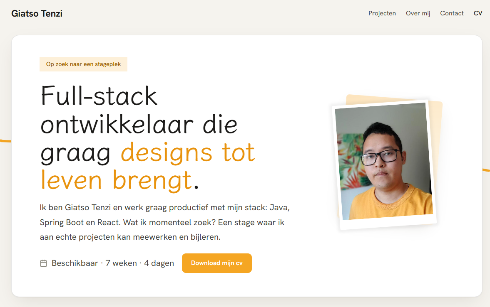

# Portfolio Website
 
A mobile-friendly portfolio website with a personalised notebook aesthetic, built from scratch with HTML, CSS and JavaScript.

 
**🔗 Live site: [pasanggiatso.be](https://www.pasanggiatso.be/)**

  
## About
 
This site started as my final project for the *User Interfaces* course and was later extended and refined for *Responsive Design*. It has since received one last visual overhaul and now serves as my live portfolio.
 
## Tech Stack
 
- **Languages:** HTML, CSS, JavaScript
- **Design tools:** Figma, Claude (Design)
- **IDE:** Visual Studio Code
  
## Design Approach
 
The visual design builds on the principles I picked up in class — colour theory and the CRAP principles (Contrast, Repetition, Alignment, Proximity). To go a step further, I also read *Refactoring UI* and carefully studied a number of existing portfolio websites.
 
With only two or three small projects to show, my portfolio risked feeling thin. My solution was to intentionally lean into a personalised **notebook aesthetic**, giving the site character that compensates for the limited amount of content.
 
## Process
 
1. **Composition in Figma (2–3 days).** I wrote out all the copy first, then combined it with images to define the overall composition of the page.
2. **Iterative refinement with Claude.** Over the course of several days I refined the typography, colours, animations and spacing step by step, using Claude as an iterative design tool — going back and forth until the notebook aesthetic felt fully realised.
Given the time I invested, I'm very happy with the result.
 
## Reflection & Future Improvements

The biggest lesson from this project is that my design is tightly coupled to my content. I deliberately traded a scalable layout system for a bespoke, art-directed notebook aesthetic — the right call for a portfolio with only a handful of projects, but it means the current page can't simply absorb more content without losing its balance.

On closer inspection, though, the limitation isn't the aesthetic itself but its single-page implementation. A notebook naturally affords growth: pages, tabs, an index. As my portfolio expands — which it will, since I'm actively looking for an internship — the plan is to lean further into the metaphor rather than abandon it: individual projects "turning the page" onto their own case-study spreads, with the homepage acting as the notebook's index.

Working iteratively with Claude also sharpened my own design judgment. Because every generated variation forced an accept-or-reject decision, I had to articulate why an option did or didn't fit the notebook concept — which taught me more about typography, spacing and visual consistency than following a tutorial ever has.
 
## Mood Board
 
- [Humanist design on Dribbble](https://dribbble.com/search/humanist)
- [Katya Ivshina on Instagram](https://www.instagram.com/katya.ivshina/)
